<a name="readme-top"></a>

[![Contributors][contributors-shield]][contributors-url]
[![Forks][forks-shield]][forks-url]
[![Stargazers][stars-shield]][stars-url]
[![Issues][issues-shield]][issues-url]
[![MIT License][license-shield]][license-url]
[![Twitter][twitter-shield]][twitter-url]

<!-- PROJECT LOGO -->
<br />
<div align="center">
  <a href="https://github.com/othneildrew/Best-README-Template">
    
  </a>

  <h3 align="center">
    Rely Wallet
  </h3>

  <p align="center">
    React Native Web3 Gateway for Ethereum & Solana.
    <br />
    <a href="https://github.com/othneildrew/Best-README-Template"><strong>Explore the docs »</strong></a>
    <br />
    <br />
    <a href="https://github.com/othneildrew/Best-README-Template/issues">Report Bug</a>
    ·
    <a href="https://github.com/othneildrew/Best-README-Template/issues">Request Feature</a>
  </p>
</div>


<!-- TABLE OF CONTENTS -->
<details>
  <summary>Table of Contents</summary>
  <ol>
    <li>
      <a href="#about-the-project">About The Project</a>
      <ul>
        <li><a href="#built-with">Built With</a></li>
      </ul>
    </li>
    <li>
      <a href="#getting-started">Getting Started</a>
      <ul>
        <li><a href="#prerequisites">Prerequisites</a></li>
        <li><a href="#installation">Installation</a></li>
      </ul>
    </li>
    <li><a href="#usage">Usage</a></li>
    <li><a href="#roadmap">Roadmap</a></li>
    <li><a href="#contributing">Contributing</a></li>
    <li><a href="#license">License</a></li>
    <li><a href="#contact">Contact</a></li>
    <li><a href="#acknowledgments">Acknowledgments</a></li>
  </ol>
</details>

<!-- ABOUT THE PROJECT -->

## About The Project

Rely Wallet is a mobile wallet that allows you to store, send, and receive tokens on any EVM compatible blockchain. Rely also supports Solana. You can use Rely to connect to any dApp on Ethereum or Solana.

- Send and receive tokens on any EVM compatible blockchain and Solana.
- Connect to any dApp on Ethereum or Solana.
- View your transaction history on various blockchains.
- View and manage your NFTs on various blockchains.

Rely is completely open source and free to use. Rely is built with React Native and uses the Moralis Stream API in order to send push notifications to users when they make a transaction or receive any tokens. Rely uses AWS API Gateway, AWS Lambda and AWS DynamoDB to store user data and send push notifications. Only the user's public address and unique device ID are stored in the database. The user's private key is never stored on the server. Our Lambda functions are written in Node.js and the Lambda functions are open source and can be found [here](https://github.com/hsyndeniz/rely-lambda-functions).

<div align="center" style="width: auto; display: flex;">
  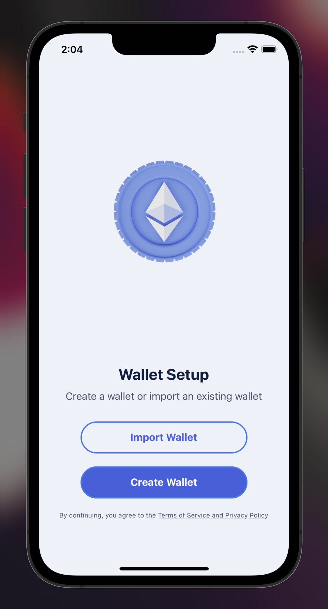
  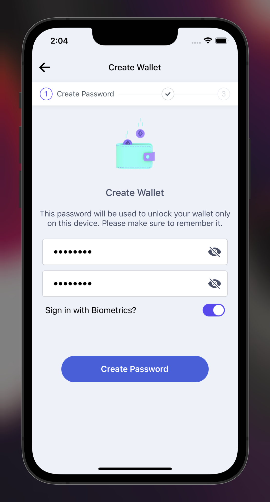
  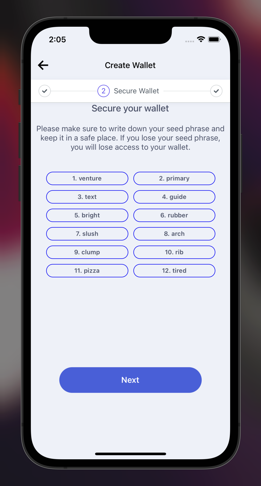
  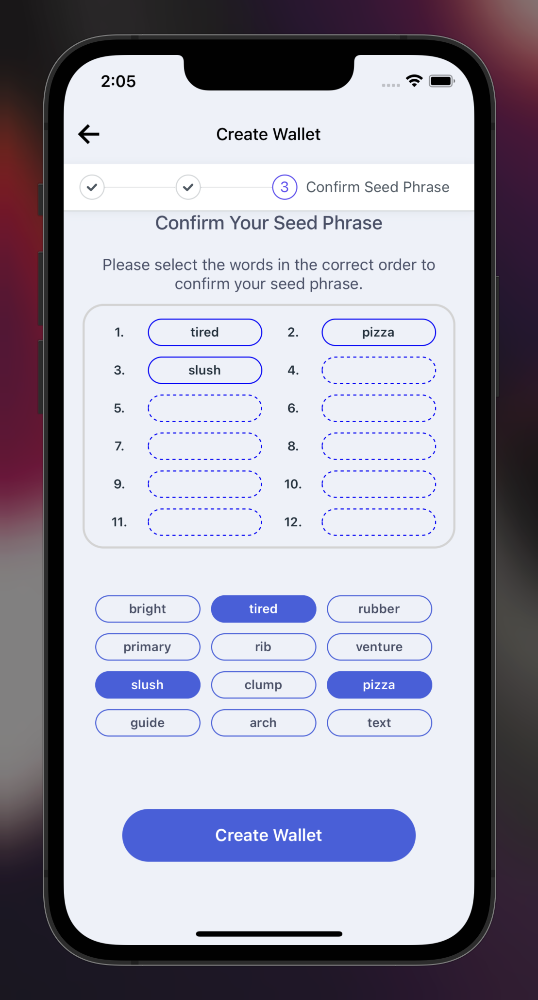
  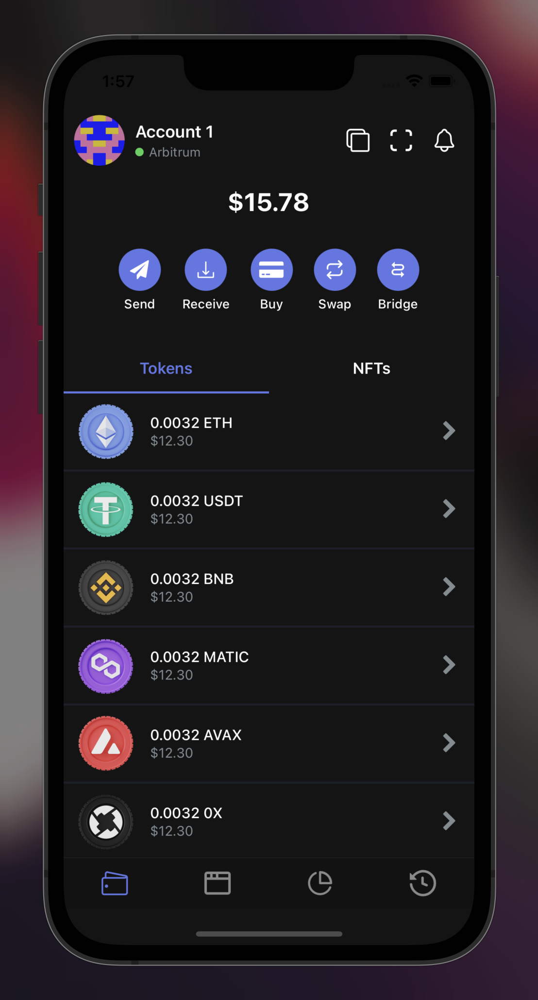
  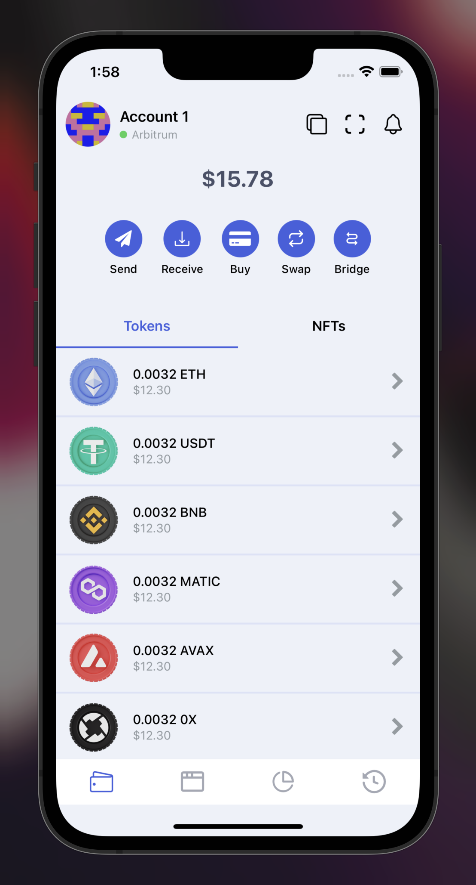
  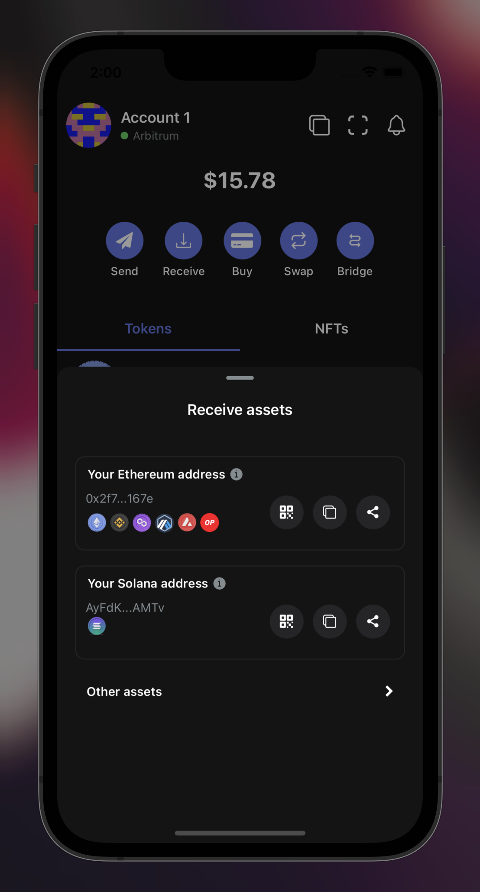
  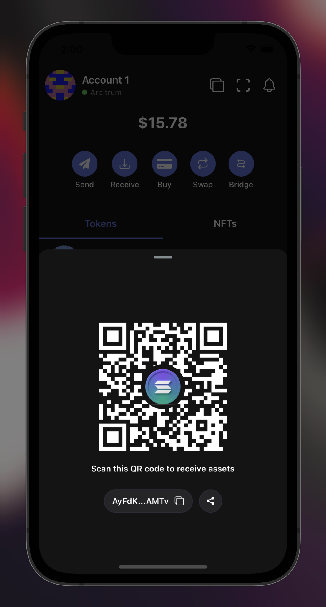
  
  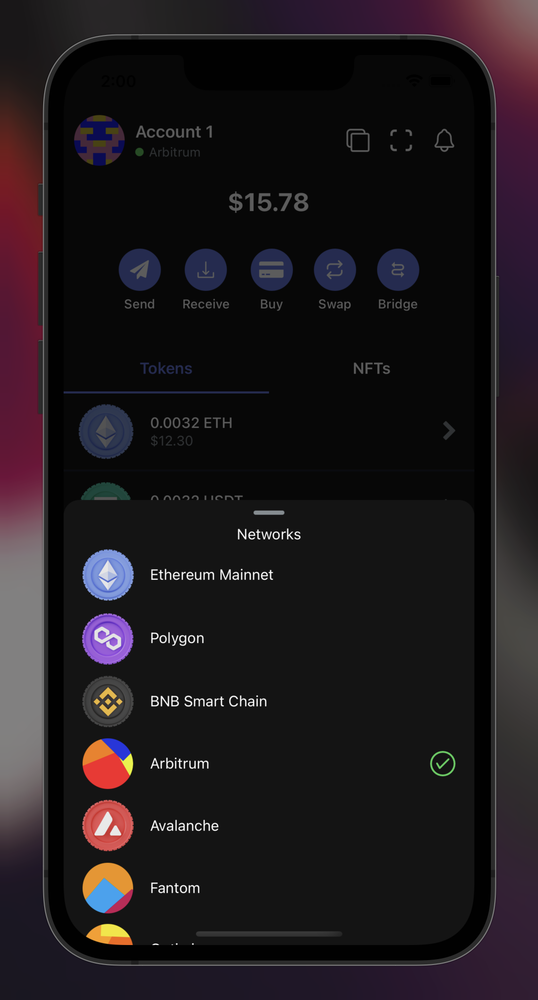
  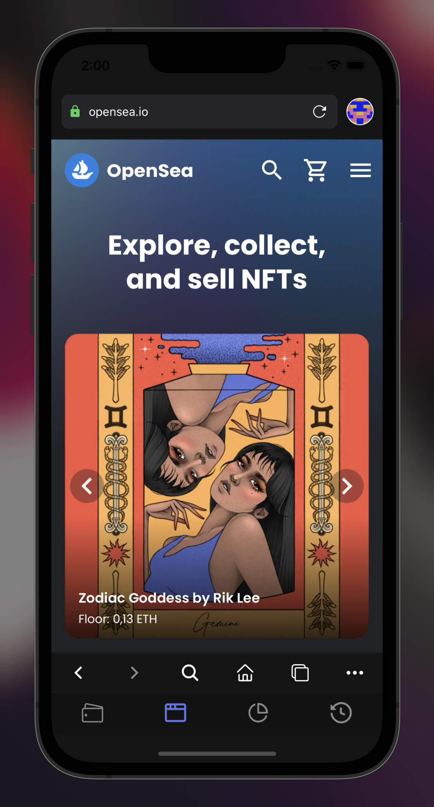
  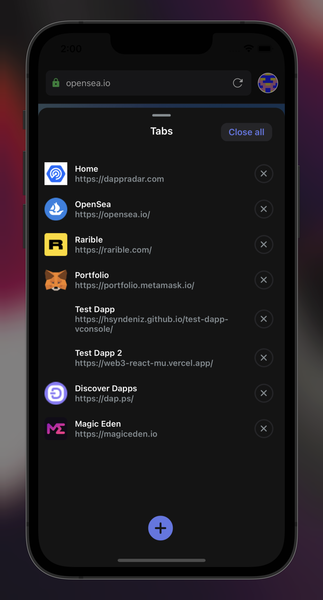
  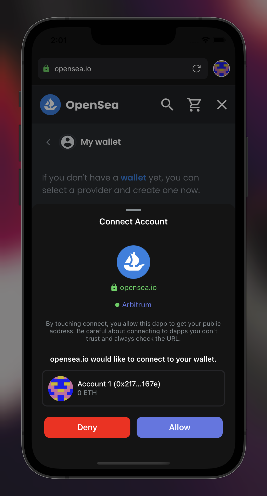
  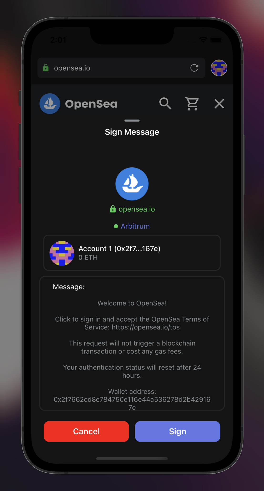
  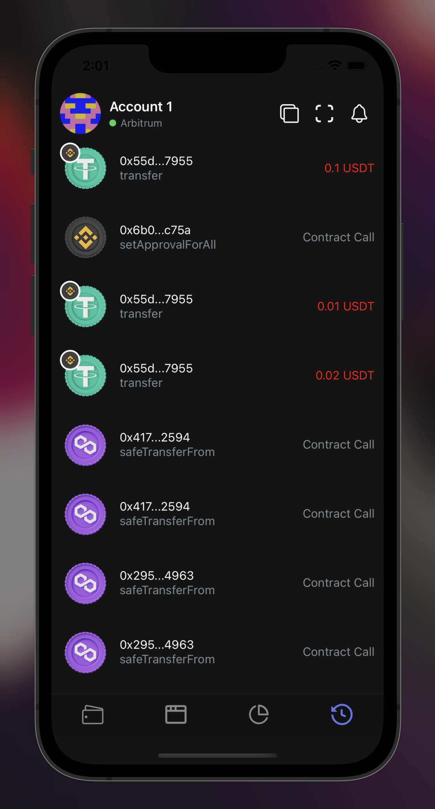
</div>

<p align="right">(<a href="#readme-top">back to top</a>)</p>

<br />

### Built With

Rely Wallet is built with the following technologies:

- [![Next][next.js]][next-url]
- [![React Native][react-native]][react-native-url]
- [![Moralis][moralis.io]][moralis-url]
- [![AWS Lambda][aws-lambda]][aws-lambda-url]
- [![AWS API Gateway][aws-api-gateway]][aws-api-gateway-url]
- [![AWS DynamoDB][aws-dynamodb]][aws-dynamodb-url]

<p align="right">(<a href="#readme-top">back to top</a>)</p>

<!-- GETTING STARTED -->

## Getting Started

Rely Wallet is completely open source and free to use. You can download the app from the [App Store](https://apps.apple.com/us/app/rely-wallet/id1573870000) or [Google Play](https://play.google.com/store/apps/details?id=com.relywallet). You can also run the app locally by following the steps below.

### Prerequisites

You will need to install React Native and Node.js requirements in order to run the app locally.
Follow the instructions [here](https://reactnative.dev/docs/environment-setup) to install React Native.

### Installation

1. Clone the repo
   ```sh
   git clone https://github.com/hsyndeniz/rely-wallet.git
   ```
2. Install NPM packages
   ```sh
   yarn
   ```
3. Edit the .env file and configure your API keys
   ```js
   const API_KEY = 'ENTER YOUR API'
   ```
4. cd into the ios folder and run pod install
   ```sh
   cd ios
   pod install
   ```
5. Run the app
   ```sh
    yarn ios
   ```
   or
   ```sh
   yarn android
   ```

<p align="right">(<a href="#readme-top">back to top</a>)</p>

<!-- ROADMAP -->

## Roadmap

- [x] Ethereum

  - [x] HD Wallet
  - [x] web3 provider for web3 browser
  - [x] Transaction History
  - [ ] ERC20 Token Support
  - [ ] ERC721 Token Support
  - [ ] ERC1155 Token Support

- [ ] Solana

  - [x] HD Wallet
  - [ ] Develop a web3 provider for Solana
  - [ ] Add Solana to the wallet list
  - [ ] Add Solana to the network list
  - [ ] Add Solana to the transaction history

- [x] Security

  - [ ] Add react-native-dotenv or react-native-config to hide API keys and other sensitive data
  - [ ] Update redux persist to use secure storage
  - [ ] Encrypt wallet
  - [ ] Use AWS API Gateway to secure API keys
  - [ ] Send signed personal message to API Gateway to register user, retrieve user data, and update user data

- [ ] Web3 Browser for Ethereum

  - [ ] window.ethereum
  - [ ] connect
  - [ ] disconnect
  - [ ] isConnected
  - [ ] isUnlocked
  - [ ] on
  - [ ] request
  - [ ] send
  - [ ] eth_accounts
  - [ ] eth_chainId
  - [ ] eth_requestAccounts
  - [ ] eth_sendTransaction
  - [ ] eth_sign
  - [ ] eth_signTypedData
  - [ ] eth_signTypedData_v3
  - [ ] eth_signTypedData_v4
  - [ ] eth_personalSign
  - [ ] eth_personal_ecRecover

- [ ] Web3 Browser for Solana

  - [ ] window.solana
  - [ ] connect
  - [ ] disconnect
  - [ ] isConnected
  - [ ] events
  - [ ] request
  - [ ] send
  - [ ] signatures

- [ ] UI/UX

  - [ ] Update Colors and other theme variables
  - [ ] Update Icons
  - [ ] Update Splash Screen
  - [ ] Update App Icon
  - [ ] Update App name, description, and screenshots
  - [ ] Update Language files
  - [ ] Update bottom sheet styles and appearance
  - [ ] Update transaction history styles
  - [ ] Update transaction history appearance
  - [ ] Update transaction history animations
  - [ ] Update transaction history filters
  - [ ] Update transaction history search
  - [ ] Update transaction history pagination
  - [ ] Update transaction history sorting
  - [ ] Update transaction history grouping
  - [ ] Update transaction history date range
  - [ ] Update transaction history details
  - [ ] Update App Store and Google Play descriptions
  - [ ] Update App Store and Google Play screenshots
  - [ ] Update App Store and Google Play privacy policy
  - [ ] Update App Store and Google Play terms of service

- [ ] Features

  - [ ] Add support for other blockchains (Klaytn)
  - [x] Touch ID
    - [x] Login with Touch ID
    - [ ] Disable login for 15 minutes
  - [ ] Permissions
    - [ ] Handle camera permissions
  - [ ] Home Screen
    - [ ] Convert to USD
    - [ ] Fetch all assets of active wallet

- [ ] Performance

  - [ ] Review and optimize code
  - [ ] Delete inlined styles
  - [ ] Delete unused components
  - [ ] Delete unused images and fonts
  - [ ] Delete unused dependencies
  - [ ] Move business logic to utils, services, helpers, and redux actions
  - [ ] Unsubscribe from onesignal when user deletes wallet or uninstalls app

- [ ] Bug Fixes

See the [open issues](https://github.com/othneildrew/Best-README-Template/issues) for a full list of proposed features (and known issues).

<p align="right">(<a href="#readme-top">back to top</a>)</p>

<!-- CONTRIBUTING -->

## Contributing

Contributions are what make the open source community such an amazing place to learn, inspire, and create. Any contributions you make are **greatly appreciated**.

If you have a suggestion that would make this better, please fork the repo and create a pull request. You can also simply open an issue with the tag "enhancement".
Don't forget to give the project a star! Thanks again!

1. Fork the Project
2. Create your Feature Branch (`git checkout -b feature/amazing-feature`)
3. Commit your Changes (`git commit -m 'Add some amazing-feature'`)
4. Push to the Branch (`git push origin feature/amazing-feature`)
5. Open a Pull Request

<p align="right">(<a href="#readme-top">back to top</a>)</p>

<!-- LICENSE -->

## License

Distributed under the MIT License. See `LICENSE` for more information.

<p align="right">(<a href="#readme-top">back to top</a>)</p>

<!-- CONTACT -->

## Contact

Your Name - [@huseyindeniz\_](https://twitter.com/huseyindeniz_) - huseyin.deniz1@hotmail.com

Project Link: [rely.craftlabs.tech](https://rely.craftlabs.tech)

<p align="right">(<a href="#readme-top">back to top</a>)</p>

<!-- ACKNOWLEDGMENTS -->

## Acknowledgments

Use this space to list resources you find helpful and would like to give credit to. I've included a few of my favorites to kick things off!

- [Choose an Open Source License](https://choosealicense.com)
- [GitHub Emoji Cheat Sheet](https://www.webpagefx.com/tools/emoji-cheat-sheet)
- [Malven's Flexbox Cheatsheet](https://flexbox.malven.co/)
- [Malven's Grid Cheatsheet](https://grid.malven.co/)
- [Img Shields](https://shields.io)
- [GitHub Pages](https://pages.github.com)
- [Font Awesome](https://fontawesome.com)
- [React Icons](https://react-icons.github.io/react-icons/search)

<p align="right">(<a href="#readme-top">back to top</a>)</p>

<!-- MARKDOWN LINKS & IMAGES -->
<!-- https://www.markdownguide.org/basic-syntax/#reference-style-links -->

[contributors-shield]: https://img.shields.io/github/contributors/othneildrew/Best-README-Template.svg?style=for-the-badge
[contributors-url]: https://github.com/othneildrew/Best-README-Template/graphs/contributors
[forks-shield]: https://img.shields.io/github/forks/othneildrew/Best-README-Template.svg?style=for-the-badge
[forks-url]: https://github.com/othneildrew/Best-README-Template/network/members
[stars-shield]: https://img.shields.io/github/stars/othneildrew/Best-README-Template.svg?style=for-the-badge
[stars-url]: https://github.com/othneildrew/Best-README-Template/stargazers
[issues-shield]: https://img.shields.io/github/issues/othneildrew/Best-README-Template.svg?style=for-the-badge
[issues-url]: https://github.com/othneildrew/Best-README-Template/issues
[license-shield]: https://img.shields.io/github/license/othneildrew/Best-README-Template.svg?style=for-the-badge
[license-url]: https://github.com/othneildrew/Best-README-Template/blob/master/LICENSE.txt
[linkedin-shield]: https://img.shields.io/badge/-LinkedIn-black.svg?style=for-the-badge&logo=linkedin&colorB=555
[linkedin-url]: https://linkedin.com/in/othneildrew
[twitter-shield]: https://img.shields.io/twitter/follow/huseyindeniz_.svg?style=social
[twitter-url]: https://twitter.com/huseyindeniz_
[product-screenshot]: images/screenshot.png
[next.js]: https://img.shields.io/badge/next.js-000000?style=for-the-badge&logo=nextdotjs&logoColor=white
[next-url]: https://nextjs.org/
[react.js]: https://img.shields.io/badge/React-20232A?style=for-the-badge&logo=react&logoColor=61DAFB
[react-url]: https://reactjs.org/
[vue.js]: https://img.shields.io/badge/Vue.js-35495E?style=for-the-badge&logo=vuedotjs&logoColor=4FC08D
[vue-url]: https://vuejs.org/
[angular.io]: https://img.shields.io/badge/Angular-DD0031?style=for-the-badge&logo=angular&logoColor=white
[angular-url]: https://angular.io/
[svelte.dev]: https://img.shields.io/badge/Svelte-4A4A55?style=for-the-badge&logo=svelte&logoColor=FF3E00
[svelte-url]: https://svelte.dev/
[laravel.com]: https://img.shields.io/badge/Laravel-FF2D20?style=for-the-badge&logo=laravel&logoColor=white
[laravel-url]: https://laravel.com
[bootstrap.com]: https://img.shields.io/badge/Bootstrap-563D7C?style=for-the-badge&logo=bootstrap&logoColor=white
[bootstrap-url]: https://getbootstrap.com
[jquery.com]: https://img.shields.io/badge/jQuery-0769AD?style=for-the-badge&logo=jquery&logoColor=white
[jquery-url]: https://jquery.com
[react-native]: https://img.shields.io/badge/React_Native-20232A?style=for-the-badge&logo=react&logoColor=61DAFB
[react-native-url]: https://reactnative.dev/
[discord-url]: https://discord.gg/6Z2WY4
[discord]: https://img.shields.io/discord/808018793602977812?color=7289DA&label=Discord&logo=discord&logoColor=white&style=for-the-badge
[moralis.io]: https://img.shields.io/badge/Moralis-000000?style=for-the-badge&logo=moralis&logoColor=white
[moralis-url]: https://moralis.io/
[aws-lambda]: https://img.shields.io/badge/AWS_Lambda-232F3E?style=for-the-badge&logo=amazon-aws&logoColor=white
[aws-lambda-url]: https://aws.amazon.com/lambda/
[aws-api-gateway]: https://img.shields.io/badge/AWS_API_Gateway-232F3E?style=for-the-badge&logo=amazon-aws&logoColor=white
[aws-api-gateway-url]: https://aws.amazon.com/api-gateway/
[aws-dynamodb]: https://img.shields.io/badge/AWS_DynamoDB-232F3E?style=for-the-badge&logo=amazon-aws&logoColor=white
[aws-dynamodb-url]: https://aws.amazon.com/dynamodb/
